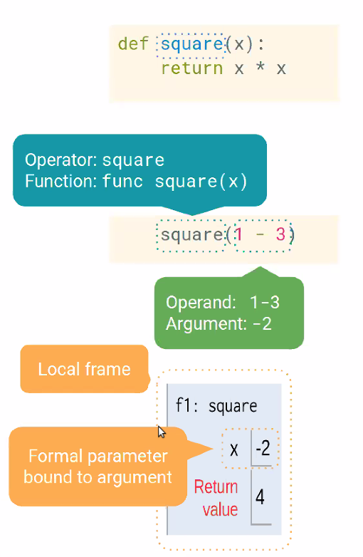

# CS 61A: Structure & Interpretation of Computer Programs

    University of California, Berkeley
    Instructors: Albert Xu, Alex Kassil, Catherine Cang
    Emails: albertxu3@berkeley.edu, alexkassil@berkeley.edu,  catherinecang@berkeley.edu
    Office Hours: cs61a.org/office-hours/
    Lecture: Mon/Tues/Thurs/Fri 12:30pm-2:00pm
    Author: Will Tholke

## Table of Contents
- [CS 61A: Structure & Interpretation of Computer Programs](#cs-61a-structure--interpretation-of-computer-programs)
  - [Table of Contents](#table-of-contents)
  - [Lecture 1, 06/22/21: Expressions](#lecture-1-062221-expressions)
    - [Expressions & Statements](#expressions--statements)
    - [Evaluation procedure for call expressions](#evaluation-procedure-for-call-expressions)
  - [Lecture 2, 06/22/21: Functions, Values, Objects, Interpreters, & Data](#lecture-2-062221-functions-values-objects-interpreters--data)
    - [Types of Expressions](#types-of-expressions)
    - [Values](#values)
    - [Names](#names)
    - [Discussion Question 1](#discussion-question-1)
    - [Environment Diagrams](#environment-diagrams)
    - [Defining Functions](#defining-functions)
    - [Calling User-Defined Functions](#calling-user-defined-functions)
    - [Environment](#environment)
  - [Lecture 3, 06/23/21: TBD](#lecture-3-062321-tbd)
    - [Subheader 1](#subheader-1)
    - [Subheader 2](#subheader-2)
    - [Subheader 3](#subheader-3)
    - [Subheader 4](#subheader-4)


## Lecture 1, 06/22/21: Expressions

### Expressions & Statements

An `expression` is a peice of code that describes computation and evaluates to some value while a *statement* is one or more lines of code that make something happen in a program; ex: expression is `1 + 2`, value is `3`

- all expressions can be written in **f(x)** form; all values are expressions, but not all expressions are values

*Example:*
```py
from operator import add, mul
add(1, 2)  
(add(add, 6, mul(4, 6)))  # evaluates a nested expression
add(2, 3)  # add is operator, 2, 3 are operands; operators and operands are expressions
```

### Evaluation procedure for call expressions

1) Evaluate the `operator`
2) Evluate the `operands` from left to right
3) Apply the operator (a function) to the evaluated operands (arguments)

## Lecture 2, 06/22/21: Functions, Values, Objects, Interpreters, & Data

### Types of Expressions

- Primitive expressions
  - Only take one step to evaluate
  - Include numbers and booleans, which evalutate to themselves

- Arithmetic expressions
  - Numbers can be combined with mathematical operators to form compound expressions
  - Operators: `+`, `-`, `*`, `**`, etc.
  - Floating point division `/`: divides the first number by the second and evaluates it to a *float*, a number with a decimal point
  - Floor division `//`: divides the first number by the second, then rounds down
  - Modulo `%`: evaluates to the positive remainder left over from division
    - Arithmetic expressions are evaluated in `PEMDAS` order

### Values

Integers, strings, floats, booleans; represent different types of data; programs manipulate values

### Names

Values can be assigned to names (variables), which can only be found to a single value; statements affect the program but do not evaluate to values; names are expressions; 

A function call is **not** a name; it re-evaluates

### Discussion Question 1

```py
f = max
g = min
h = max
max = g
result = max(f(2, g(h(1, 5), 3)), 4)
print(result)  #  min(max(2, min(max(1, 5), 3)), 4)
```

### Environment Diagrams

- [Online Python Tutor](http://pythontutor.com/composingprograms.html#mode=edit)
- Names are bound to **values** in an *environment*

### Defining Functions

```py
def <name>(<parameters>):  # function signature
    return <return expression>  #body
```

We don't enter inside the function until we call the function.

### Calling User-Defined Functions

1) Create a new *environment frame*
2) Bind the function's parameters to its arguments in that frame
3) Execute the body of the function in the new argument



### Environment
A sequence of frames; so far, we've seen the global frame and a function's local frame

## Lecture 3, 06/23/21: TBD

### Subheader 1

### Subheader 2

### Subheader 3

### Subheader 4